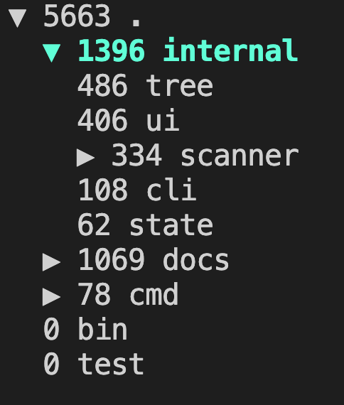

# loctree - Lines of Code Tree Viewer

A terminal user interface (TUI) application that provides an interactive, hierarchical view of lines of code (LOC) counts for a given directory structure.



## How this application was developed

The application was written entirely by Claude Code, using the https://github.com/humansintheloop-dev/humansintheloop-dev-workflow-and-tools[Humans in the loop development workflow and tools]

## Features

- 📊 Displays total LOC count for directories
- 🌳 Interactive tree view with expand/collapse
- ⚡ Fast scanning with binary file detection
- 🎨 Syntax highlighting for selected items
- 📁 Sorts directories by LOC count (descending)
- 🚫 Automatically ignores hidden directories and symbolic links

## Installation

```bash
# Clone the repository
git clone https://github.com/user/loctree.git
cd loctree

# Build the application
make build

# Or install directly with Go
go install github.com/user/loctree/cmd/loctree@latest
```

## Usage

```bash
# Run loctree on a directory
loctree /path/to/directory

# Example
loctree ~/projects/myapp
```

## Keyboard Controls

| Key | Action |
|-----|--------|
| ↑/k | Navigate up |
| ↓/j | Navigate down |
| Space/Enter | Expand/collapse directory |
| q/Ctrl+C | Quit |

## How It Works

1. **Scanning**: Recursively scans the directory tree
2. **Line Counting**: Counts lines in text files, ignores binary files
3. **Tree Building**: Constructs a hierarchical tree structure
4. **Sorting**: Sorts directories by LOC count (highest first)
5. **Display**: Renders an interactive TUI with Bubble Tea

## Development

```bash
# Run tests
make test

# Run the application
make run

# Clean build artifacts
make clean
```

## Technical Details

- Written in Go
- Uses [Bubble Tea](https://github.com/charmbracelet/bubbletea) for TUI
- Uses [Lipgloss](https://github.com/charmbracelet/lipgloss) for styling
- Binary detection by checking for null bytes
- Ignores:
  - Hidden directories (starting with `.`)
  - Symbolic links
  - Binary files (counted as 0 LOC)

## License

MIT